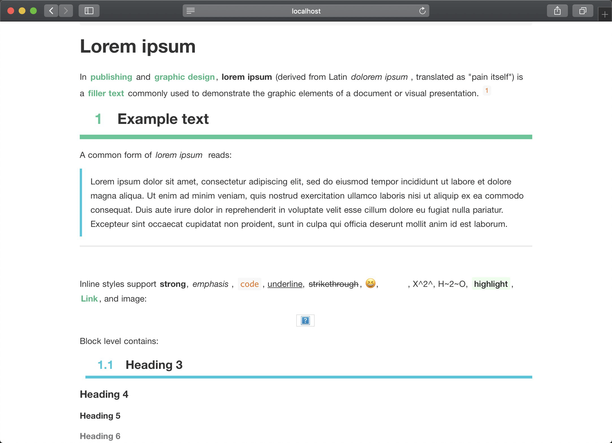

# typora-downgoon-theme

[中文](README_CN.md)

A forked variation of [typora-theme-vue](https://github.com/blinkfox/typora-vue-theme) with some additional features such as hightlight and numbered headlines.

> *Designed and tested on MacOS. Not fully tested, but should work for Windows/Linux.*

## Introduction

[Typora](https://www.typora.io/) is a markdown editor and reader that supports real-time preview. It supports `Windows`, `macOS`, `Linux` platforms. Typora is a qualified Markdown editor that supports images, lists, tables, codes, formulas, catalogs, etc. At the same time, typora also supports (one-click) dynamic preview function, so that everything becomes so clean and pure. And there are various theme templates. such as [typora-vue-theme](https://github.com/blinkfox/typora-vue-theme) inspired by [Vue](https://vuejs.org/) document style and **its forked variation of [typora-theme-downgoon](https://github.com/downgoon/typora-theme-downgoon) with hightlight and numbered headlines**.

## Install

1. [Download](https://codeload.github.com/blinkfox/typora-vue-theme/zip/master) this theme from Github, then you can get the `downgoon.css` file and the `downgoon` folder.
2. Open typora. Click "**Open Theme Folder**" button from `Preference Panel` → `Apperance` section.
3. Put `downgoon.css` and `downgoon` folder into the opened folder, make sure your css files are directly under that directory.
4. Close and reopen Typora and select `Theme` → `downgoon` from the menu bar.

## Screenshots

- **hightlight and numbered headlines** testing on [lorem.html](https://github.com/typora/typora-theme-toolkit/blob/master/html-preview/html/lorem.html)

- **source code mode** tesing on [source-mode.html](https://github.com/typora/typora-theme-toolkit/blob/master/html-preview/html/source-mode.html)

