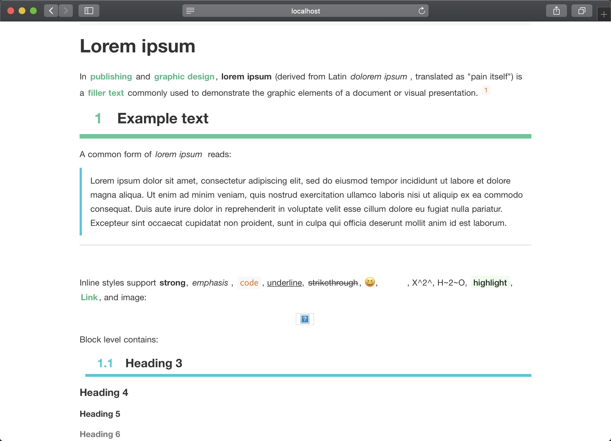
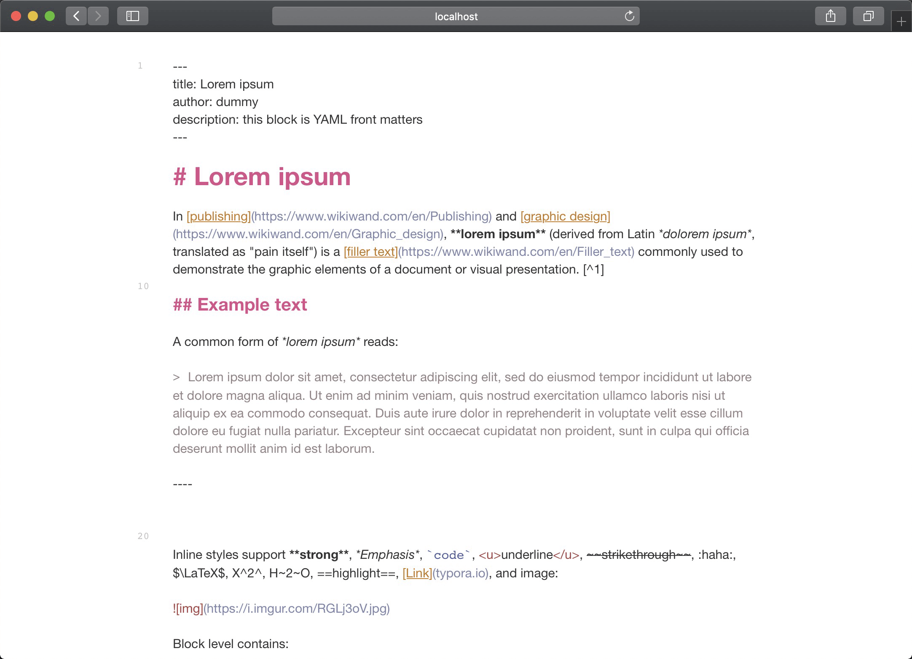

# typora-vue-theme

[English](README.md)

本主题样式是 [typora-theme-vue](https://github.com/blinkfox/typora-vue-theme) 的一个变种，主要增加了标题高亮渲染和自动编号的功能。

## 简介

[Typora](https://www.typora.io/)是一款支持实时预览的 Markdown 编辑器和阅读器，支持`Windows`、`macOS`、`Linux`三大平台。Typora 作为一款合格的 Markdown 编辑器，支持图片、列表、表格、代码、公式、目录等功能，同时这款软件还支持（一键）动态预览功能，让一切都变得如此干净、纯粹。并且有多种主题模板。[typora-vue-theme](https://github.com/blinkfox/typora-vue-theme)就是参考了[Vue](https://vuejs.org/)文档风格而开发的一个 Typora 自定义主题。而 [typora-theme-downgoon](https://github.com/downgoon/typora-theme-downgoon) 是它的基础上演变而来，主要增加了 **对标题进行高亮渲染和自动编号** 的功能。

## 安装主题

1. [下载](https://github.com/downgoon/typora-theme-downgoon/archive/master.zip)本主题中的`downgoon.css`文件和包含字体的`downgoon`文件夹；
2. 打开 Typora，点击“**偏好设置**” => “**打开主题文件夹**”按钮，将弹出 Typora 的主题文件夹；
3. 将下载好的`downgoon.css`和包含字体的`downgoon`文件夹放到 Typora 的主题文件夹中；
4. 关闭并重新打开 Typora，从菜单栏中选择 “**主题**” => “**downgoon**” 即可。

## 效果图

- **标题高亮显示和自动编号**: 在官方提供的  [lorem.html](https://github.com/typora/typora-theme-toolkit/blob/master/html-preview/html/lorem.html) 测试用例的呈现效果

- **源代码模式** ：在官方提供的 [source-mode.html](https://github.com/typora/typora-theme-toolkit/blob/master/html-preview/html/source-mode.html) 测试用例的呈现效果

